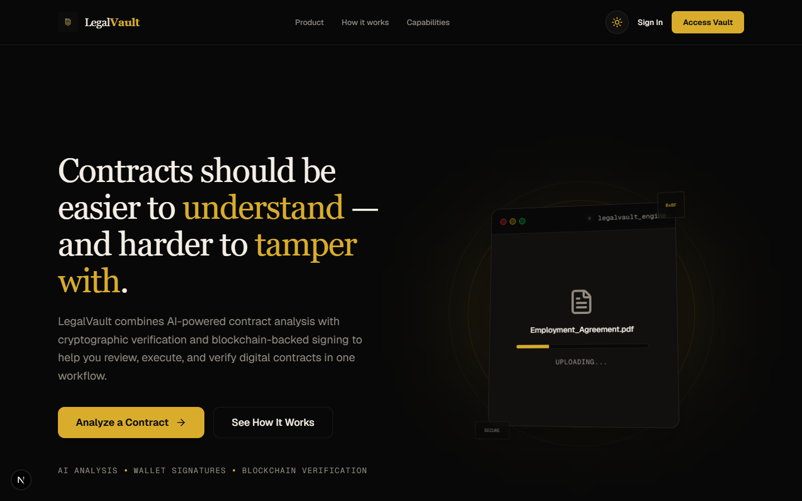
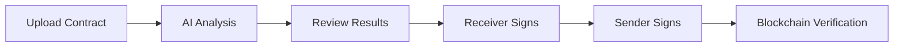
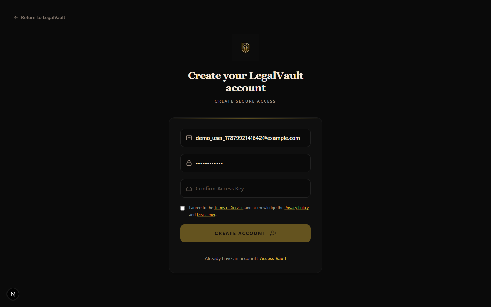
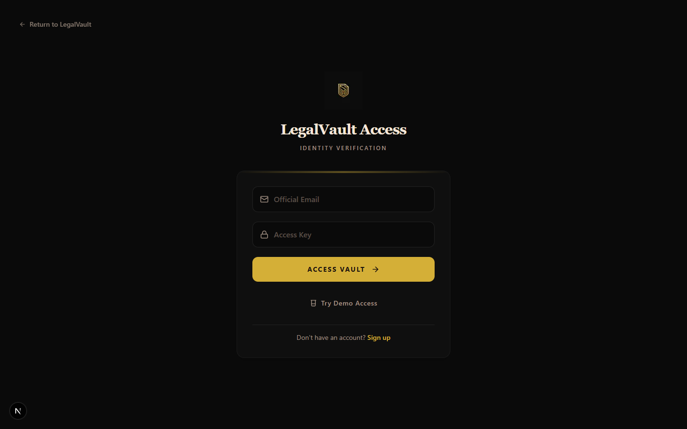

# LegalVault

### AI-powered contract intelligence, digital execution, and verification.



LegalVault is a digital contract platform designed to help users analyze contracts, identify important risks and clauses, execute signing workflows, and verify contract integrity through a unified application. By combining artificial intelligence with cryptographic verification, LegalVault ensures transparency, security, and immutability for all your agreements.

---

## Core Capabilities

<table>
<tr>
<td width="50%">

### AI Contract Analysis

Upload your contracts and receive an immediate, in-depth analysis powered by our custom Python-based AI model server. The platform extracts critical metadata, pinpoints risks (categorized by severity), flags missing clauses, and highlights key negotiation points.

</td>
<td width="50%">

### Contract Management

Keep track of all your agreements in one place. Contracts are stored securely in Supabase, and our dashboard allows you to monitor the status of every document—whether it's pending review, awaiting signatures, or finalized.

</td>
</tr>
<tr>
<td>

### Digital Signing

Execute contracts directly within the platform. Both senders and receivers can securely sign agreements. The platform enforces a strict signature workflow ensuring that all parties are properly authenticated before finalizing the document.

</td>
<td>

### Cryptographic Verification

Every finalized contract is hashed using SHA-256 and securely logged on the blockchain (Ethereum Sepolia Testnet). The platform allows you to verify any document against the blockchain ledger to ensure it hasn't been tampered with since execution.

</td>
</tr>
</table>

## How it Works



1. **Upload & Analyze**: Senders upload a contract (PDF, DOCX, TXT) to the platform. The AI model analyzes the text to provide risk assessment and negotiation points.
2. **Review & Send**: Senders can review the contract and designate a receiver. The contract is saved and the receiver is notified.
3. **Dual Signature**: The receiver securely logs in and signs the contract. Following this, the sender signs the contract.
4. **Finalization & Blockchain Log**: Once both signatures are recorded, the contract's hash is stored immutably on the Ethereum blockchain. For ultimate privacy, the actual contract file is deleted from our cloud storage after finalization.
5. **Independent Verification**: Anyone with the original document and transaction hash can use the Legal Verifier to confirm the document's authenticity against the blockchain ledger.

## Architecture & Technology Stack

The platform is designed around a microservices architecture:

- **Frontend**: Next.js 14, React, Tailwind CSS
- **Backend API**: Node.js, Express, Ethers.js, Multer
- **AI Model Server**: Python, gRPC, Pydantic (interfaces with the legal intelligence pipeline)
- **Database & Auth**: Supabase (PostgreSQL, Storage, and Authentication)
- **Blockchain**: Ethereum (Sepolia Testnet) via Infura

## User Interfaces

### Dashboard & Management


### Secure Authentication


### Independent Verification Portal


## Repository Structure

- `/frontend` - The Next.js web application.
- `/backend` - The Node.js Express server handling API requests, blockchain transactions, and database interactions.
- `/model` - The Python gRPC server containing the AI analysis pipeline.
- `/proto` - Protobuf definitions shared between the backend and the AI model server.
- `/docs` - Project documentation and assets.

## Quick Start (Development)

### Prerequisites

- Node.js v18+
- Python 3.10+
- Supabase account (or local instance)
- Ethereum Wallet & RPC URL (e.g., Infura)

### Setup

1. **Clone the repository**
2. **Install dependencies for all workspaces**
   ```bash
   npm install --workspaces
   ```
3. **Setup the Python AI Model Server**
   ```bash
   cd model
   python -m venv .venv
   source .venv/bin/activate  # (or .venv\Scripts\activate on Windows)
   pip install -r requirements.txt
   ```

### Environment Variables

You need to configure the environment variables for each component. Example files are provided:

- `frontend/.env.local`: Requires `NEXT_PUBLIC_SUPABASE_URL`, `NEXT_PUBLIC_SUPABASE_ANON_KEY`, and `NEXT_PUBLIC_API_BASE_URL`.
- `backend/.env`: Requires `SUPABASE_URL`, `SUPABASE_SERVICE_ROLE`, `RPC_URL`, `PRIVATE_KEY`, `CONTRACT_ADDRESS`, `EMAIL_USER`, and `EMAIL_PASS`.
- `model/.env`: Requires API keys for your chosen LLM provider (e.g., `GEMINI_API_KEY`).

### Running Locally

Use the provided batch script to launch all services concurrently (Windows):

```bash
start_dev.bat
```

Alternatively, start them individually:

**AI Model Server**
```bash
cd model
source .venv/bin/activate
python grpc_server.py
```

**Node.js Backend**
```bash
cd backend
npm run dev
```

**Next.js Frontend**
```bash
cd frontend
npm run dev
```

## Security & Privacy

- **Cryptographic Hashing**: Contracts are hashed (SHA-256) locally and server-side to guarantee integrity.
- **Ephemeral Storage**: Fully executed contracts are deleted from our servers once their hashes are committed to the blockchain, ensuring long-term privacy.
- **Role-based Verification**: Only authorized senders and receivers can access contract contents before finalization.

## Limitations & Notes

- **Email Delivery**: SMTP via Render Free Tier / standard Gmail may occasionally be blocked. Refer to backend logs if invites fail to send.
- **Blockchain Finality**: Transactions on the Sepolia testnet may take up to 15 seconds to confirm.
- **File Parsing**: The current implementation primarily supports standard text and PDF structures for AI analysis. Highly graphical PDFs may require additional OCR capabilities.

## Copyright & Usage

Copyright © digital-contract-platform .

All rights reserved.

This repository and its contents are proprietary. No permission is granted
to copy, modify, distribute, sublicense, publish, or use this software or
any portion of it for commercial purposes without prior written permission
from the copyright holder.

The source code is publicly available for viewing and educational/reference
purposes only. Public visibility of this repository does not constitute a
license to use, reproduce, distribute, modify, or commercially exploit the
software.